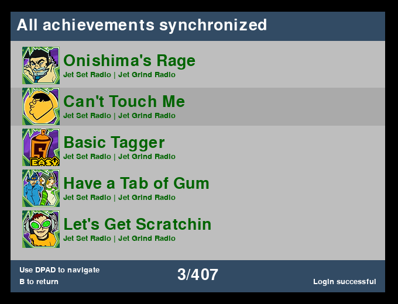

# Sync Failed RetroAchievement Unlocks




## Overview

This program detects and synchronizes RetroAchievements that failed to upload (usually due to loss of network connectivity while playing), by comparing automatically saved achievement screenshots with the list of unlocked RetroAchievements. It is designed for RG(28/35/40)XX(+/SP/H/DS) devices running Batocera/Knulli, but you can use it on other devices as long as your RetroAchievements screenshots are collected in a single folder and your device supports PyGame. Alternatively, install PyGame on any (Linux) computer with `pip install pygame`, copy or mount the screenshot directory from your handheld device and run this program locally.

## Installation

On Anbernic RG##XX devices running Batocera/Knulli, simply place `sync_achievements.pygame` in the `/userdata/roms/pygame` directory and trigger a gamelists reload so it shows up in the PyGame folder. Add the images directory as well, if you want EmulationStation to show you a screenshot. If PyGame does not show up on your homescreen, you may need to manually enable it in the EmulationStation settings. The RetroAchievements credentials are automatically loaded from the batocera configuration.

To use this program on other devices and operating systems, you need to manually enter your RetroAchievements credentials and screenshots directory. You can do this by editing the following lines in `sync_achievements.pygame` near the top of the file:

```
USERNAME_OVERRIDE = 'ENTER_CREDENTIALS_HERE'
PASSWORD_OVERRIDE = 'ENTER_CREDENTIALS_HERE'
SCREENSHOTS_DIRECTORY = '/userdata/screenshots/'
```

Replace `ENTER_CREDENTIALS_HERE` with your RetroAchievements username and password and ensure the `SCREENSHOTS_DIRECTORY` path points to the directory containing your RetroAchievements screenshots.

## Hardcore mode

Achievements are always submitted with Hardcore mode disabled. This is a feature, not a bug. The unlock requests work by repeating the unlock requests to the RetroAchievements server, but the unlock date/time is unfortunately tracked on the server-side. This means the unlocks trigger the moment the program runs, not the moment the screenshots were made (resulting in inplausibly quick unlocks, especially when syncing achievements from multiple different games). For Hardcore mode, this could result in your account getting banned. 

If you like to live dangerously, you can edit the `send_unlock_request()` function to set `'h': 1` and send unlock requests with Hardcore mode enabled. However, the safer and strongly recommended option is to go through the official channels and request your Hardcore unlocks manually via the RetroAchievements Discord server.

## License

This program is free software: you can redistribute it and/or modify it under the terms of the GNU Affero General Public License as published by the Free Software Foundation, either version 3 of the License, or (at your option) any later version.

## Copyright

© 2024 Louis van Harten

